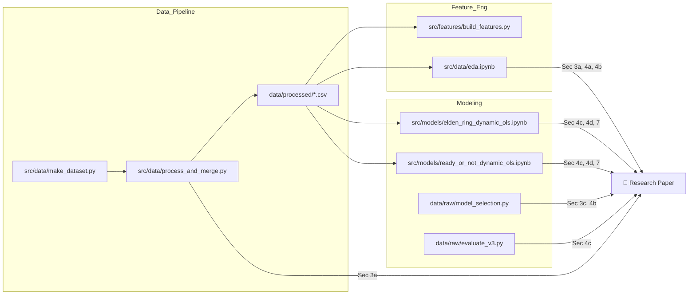

# 📋 GAP ANALYSIS: Từ Poster G6 → Final Research Paper (20-30 trang)

> [!IMPORTANT]
> **Deadline: 29/04/2026 23:59** | Email: hangnpt@neu.edu.vn | APA Style | Double-spaced | ≥5 academic sources

---

## PHẦN 1: Khai thác Tài nguyên từ Poster (What We Have)

### 1.1. Tiêu đề & Thông tin chung
- **Title**: *"Stockpile or Instant Play? A Dynamic OLS Approach to Price Elasticity in the Gaming Industry"*
- **Authors**: Vu Ngoc Hong Anh, Tran Minh Duc, Tran Dinh Tuan Phong, Truong Hoang Tung
- **Affiliation**: Time Series | DSEB65A | National Economics University

### 1.2. Giả thuyết nghiên cứu (Hypotheses)
- **H1 (Instant Play)**: Multiplayer games exhibit high price elasticity and strong social contagion, driving immediate spikes
- **H2 (Stockpiling)**: Single-player games are price-inelastic at the player level due to library stockpiling, relying on updates for revival

### 1.3. Phương pháp luận (Methodology)
- **Mô hình chính**: Dynamic OLS (ARMAX equivalent) với HC3 Robust Standard Errors
- **Biến phụ thuộc**: `Log_Player` (log-transformed concurrent players)
- **Biến độc lập**: `Lag_Player`, `Discount_Ratio`, `Log_Twitch_Avg`, `Is_Major_Update`, `Is_Weekend`, `Years_Since_Release`, `Discount × Years` (interaction term)
- **Detrended**: `Years_Since_Release` để loại bỏ xu hướng dài hạn
- **Seasonality control**: `Is_Weekend`
- **Data Sources**: SteamDB, TwitchTracker API
- **Data Range**: Ready or Not (12/2021–03/2026) | Elden Ring (02/2022–03/2026)
- **Observations**: Ready or Not (1564) | Elden Ring (1496)

### 1.4. Bảng hệ số hồi quy (Poster Table)

| Variable | Ready Or Not | Elden Ring |
|---|---|---|
| Lag_Player | 0.8387*** | 0.9686*** |
| Discount_Ratio | 0.5390*** | 0.2765*** |
| Log_Twitch_Avg | 0.0473*** | -0.0032 |
| Is_Major_Update | 0.1590*** | 0.0306* |
| Is_Weekend | 0.1268*** | 0.1348*** |
| Discount × Years | -0.0970*** | -0.0528* |

> Ghi chú: `***` p<0.01, `**` p<0.05, `*` p<0.1, ns = not significant

### 1.5. Hiệu suất mô hình (trên Poster)
- **Ready or Not**: MAPE 7.87%, BIC -2265
- **Elden Ring**: MAPE 11.4%, BIC -1839

### 1.6. Key Econometric Findings (4 điểm chính)
1. **Divergent Price Elasticity**: Multiplayer → 25.0% surge (Year-1 sale, p<0.01); Single-player → 7.7% increase → validates H2 (Stockpiling)
2. **Price Saturation (Decay Effect)**: Interaction `Discount × Years` negative (-0.0970, p<0.01) → price elasticity decays from 25.0% to 13.2% by Year 3
3. **Spectator Paradox**: Twitch viewership drives multiplayer engagement but has zero statistical impact on single-player (Elden Ring: coeff = -0.0032, ns)
4. **Content as Lifecycle Savior**: Major updates → 17.2% multiplayer surge; only 3.1% for single-player

### 1.7. Literature đã trích dẫn trên Poster (7 nguồn)
1. Darbanian et al. (2025) — Fresh vs. Frozen promotions
2. Hirche et al. (2021) — SARIMAX for retail time series
3. Phumchusri et al. (2022) — Promotional pricing effectiveness
4. Zhong et al. (2022) — Game updates & player engagement (DOTA2)
5. Dey et al. (2016) — Versioning in horizontal markets
6. Johnson & Woodcock (2018) — Twitch impact on gaming
7. Wang & Chen (2022) — Online promotion habits
8. Zou et al. (2018) — Purchase intention in live streaming

### 1.8. Limitations & Future Directions (đã có trên Poster)
- Inferential vs. Predictive Design (model tối ưu cho elasticity estimation, không phải t+1 forecasting)
- Archetypal Sampling (chỉ 2 game đại diện; cần mở rộng Panel Data)
- Platform Ecosystem (chỉ PC/Steam; chưa có console cross-play)

### 1.9. Conclusion & Strategy (đã có trên Poster)
- Pricing Optimization: Phase out deep discounts for aging titles
- Marketing Allocation: Reallocate Twitch budgets exclusively to Multiplayer
- Lifecycle Management: Prioritize Major Content Updates (DLCs) over promotions

---

## PHẦN 2: Phân tích Khoảng trống (Gap Analysis)

### Bảng đối chiếu: Guidelines vs. Poster

| # | Yêu cầu Guidelines | Đã có trên Poster? | Nội dung cần viết mới / mở rộng |
|---|---|---|---|
| **1a** | Introduction — Research Question | ✅ Một phần (problem statement) | Viết 2 trang: Mở rộng bối cảnh ngành gaming ($187B market), đặt câu hỏi nghiên cứu rõ ràng (RQ1, RQ2), giải thích significance, đóng góp của bài nghiên cứu |
| **1b** | Introduction — Significance | ⚠️ Sơ lược | Cần giải thích tại sao price elasticity trong digital goods khác physical goods, tại sao gaming industry là context tốt để nghiên cứu |
| **2a** | Lit Review — Background context | ⚠️ Rất sơ lược | Viết 3-4 trang: Mở rộng từ 7 references → ≥5 scholarly sources. Tổng hợp thành các dòng nghiên cứu (pricing theory, time series in retail, streaming economics, game lifecycle) |
| **2b** | Lit Review — What we know/don't know | ❌ Thiếu | Cần viết phần "research gap": chưa ai dùng Dynamic OLS so sánh 2 archetype game (Multiplayer vs Single-player) |
| **2c** | Lit Review — How your research relates | ❌ Thiếu | Positioning bài nghiên cứu: kế thừa SARIMAX framework (Hirche, 2021), mở rộng "Fresh vs Frozen" (Darbanian, 2025) sang digital goods |
| **3a** | Methods — Describe data | ⚠️ Bullet points | Viết 1-2 trang: Data collection process (SteamDB API, TwitchTracker), frequency (daily), period, cleaning pipeline, missing value handling (interpolation, ffill) |
| **3b** | Methods — Variables description | ⚠️ Chỉ liệt kê tên | Cần bảng mô tả biến: tên biến, đơn vị đo, transformation (log1p), lý do chọn, expected sign |
| **3c** | Methods — Statistical techniques | ⚠️ Sơ lược | Cần mô tả chi tiết: (1) Dynamic OLS specification, (2) HC3 robust SE rationale, (3) Ablation study design (3 nested models), (4) Diagnostic battery (BP, LB, ADF) |
| **4a** | Results — Descriptive Statistics | ❌ **THIẾU HOÀN TOÀN** | **Bắt buộc**: Bảng mean, std, min, max cho tất cả biến (cả 2 game). Lấy từ EDA notebook |
| **4b** | Results — Pre-tests | ❌ **THIẾU HOÀN TOÀN** | **Bắt buộc**: Bảng ADF/KPSS stationarity tests, correlation heatmap, VIF multicollinearity check |
| **4c** | Results — Main analysis | ✅ Có bảng hệ số | Cần mở rộng: trình bày song song 3 Models (ablation), giải thích từng bước thêm biến, so sánh AIC/BIC giữa M1→M2→M3 cho cả 2 game |
| **4d** | Results — Economic interpretation | ⚠️ Có nhưng tóm tắt | Viết 2-3 trang: Diễn giải chi tiết từng hệ số (marginal effect), back-transform từ log-scale sang % actual players, so sánh cross-game |
| **5a** | Discussion — Summarize findings | ⚠️ Có nhưng ngắn | Viết 3 trang: Tổng hợp 4 findings chính, đặt trong bối cảnh lý thuyết, so sánh với literature |
| **5b** | Discussion — Relate to literature | ❌ **THIẾU** | Cần thảo luận: kết quả có ủng hộ hay mâu thuẫn với Phumchusri (2022), Zhong (2022), Johnson & Woodcock (2018)? |
| **6** | Bibliography (APA, ≥5 sources) | ⚠️ Có 8 refs nhưng chưa APA | Chuyển đổi sang APA format chuẩn, kiểm tra đủ 5 academic/scholarly sources |
| **7** | Appendices (tables, figures, code) | ❌ **THIẾU HOÀN TOÀN** | **Bắt buộc**: (1) Full OLS summary tables, (2) Diagnostic tables (BP, LB, ADF), (3) ACF/PACF plots, (4) Forecast vs Actual plots, (5) Code snippets |

### Tóm tắt mức độ ưu tiên

> [!CAUTION]
> **Thiếu hoàn toàn (❌) — Phải viết mới:**
> - 4a: Descriptive Statistics
> - 4b: Pre-tests (ADF, VIF, Correlation)  
> - 5b: Discussion relating to literature
> - 7: Appendices (toàn bộ)
> - 2b, 2c: Research gap & positioning

> [!WARNING]
> **Có nhưng cần mở rộng đáng kể (⚠️):**
> - 1a, 1b: Introduction (2 trang)
> - 2a: Literature Review (3-4 trang)
> - 3a-3c: Methods (1-2 trang)
> - 4c, 4d: Results interpretation (4-5 trang)
> - 5a: Discussion (3 trang)
> - 6: Bibliography (APA format)

---

## PHẦN 3: Chiến lược Rà soát Code (Repo Review Strategy)

### 3.1. Sơ đồ File → Section Mapping



### 3.2. Checklist chi tiết: File nào → Lấy gì → Đắp vào đâu

#### ✅ Cho Mục 3 (Methods) — Data Description

| Checklist | File nguồn | Block/Output cần lấy | Đưa vào mục |
|---|---|---|---|
| ☐ Mô tả data pipeline | [process_and_merge.py](file:///c:/Users/HOANG%20TUNG/time_series_project/src/data/process_and_merge.py) | Hàm `clean_and_engineer_features()` — mô tả 6 bước xử lý | Methods §3a |
| ☐ Data sources & frequency | [config.yaml](file:///c:/Users/HOANG%20TUNG/time_series_project/configs/config.yaml) | Phần `data:` paths, date format, columns | Methods §3a |
| ☐ Variable descriptions table | [process_and_merge.py](file:///c:/Users/HOANG%20TUNG/time_series_project/src/data/process_and_merge.py) L86-101 | `cols_to_keep` list + transformations (log1p, /100, /365) | Methods §3b |
| ☐ Missing value strategy | [process_and_merge.py](file:///c:/Users/HOANG%20TUNG/time_series_project/src/data/process_and_merge.py) L47-62 | Robust imputation: 0→NaN, interpolate→ffill→bfill | Methods §3a |
| ☐ Train/Test split rationale | Cả 2 DOLS notebooks, Cell 2 | 80/20 chronological split, cutoff dates | Methods §3c |

---

#### ✅ Cho Mục 4a (Results — Descriptive Statistics) ❌ THIẾU

| Checklist | File nguồn | Block/Output cần lấy | Đưa vào mục |
|---|---|---|---|
| ☐ Summary statistics table | [eda.ipynb](file:///c:/Users/HOANG%20TUNG/time_series_project/src/data/eda.ipynb) Cell 3 | `df.describe()` output cho cả Elden Ring & Ready or Not | Results §4a → **Table 1** |
| ☐ Missing values report | [eda.ipynb](file:///c:/Users/HOANG%20TUNG/time_series_project/src/data/eda.ipynb) Cell 3 | `df.isnull().sum()` — đã confirm = 0 cho tất cả biến | Results §4a |
| ☐ Observations count | Notebooks Cell 2 | ER: 1496 (train 1405, test 91) / RoN: ~1564 (train 1473, test ~91) | Results §4a |

---

#### ✅ Cho Mục 4b (Results — Pre-tests) ❌ THIẾU

| Checklist | File nguồn | Block/Output cần lấy | Đưa vào mục |
|---|---|---|---|
| ☐ Correlation Heatmap | [eda.ipynb](file:///c:/Users/HOANG%20TUNG/time_series_project/src/data/eda.ipynb) Cell 5 | Heatmap figures (2 game) | Results §4b → **Figure 1** |
| ☐ ACF/PACF plots | [eda.ipynb](file:///c:/Users/HOANG%20TUNG/time_series_project/src/data/eda.ipynb) Cell 10 | ACF, PACF, Weekend boxplot (2 game) | Results §4b / Appendix |
| ☐ ADF Test on raw series | [build_features.py](file:///c:/Users/HOANG%20TUNG/time_series_project/src/features/build_features.py) L113-161 | `test_stationarity()` → ADF stat, p-value, KPSS stat | Results §4b → **Table 2** |
| ☐ ADF Test on residuals | [elden_ring_dynamic_ols.ipynb](file:///c:/Users/HOANG%20TUNG/time_series_project/src/models/elden_ring_dynamic_ols.ipynb) Cell 7 & [ready_or_not_dynamic_ols.ipynb](file:///c:/Users/HOANG%20TUNG/time_series_project/src/models/ready_or_not_dynamic_ols.ipynb) Cell 6-8 | ADF on residuals: ER=-5.786 (p=5e-7), RoN M1=-6.205 (p=5.7e-8) | Results §4b → **Table 3** |
| ☐ VIF (nếu cần bổ sung) | **⚠️ CHƯA CÓ TRONG CODE** | Cần viết thêm code tính VIF từ `statsmodels.stats.outliers_influence.variance_inflation_factor` | Results §4b |

> [!WARNING]
> **VIF chưa được tính trong bất kỳ notebook nào.** Cần bổ sung 1 cell code trong notebook hoặc viết script riêng để tính VIF cho feature matrix trước khi nộp báo cáo.

---

#### ✅ Cho Mục 4c (Results — Main Analysis)

| Checklist | File nguồn | Block/Output cần lấy | Đưa vào mục |
|---|---|---|---|
| ☐ Elden Ring OLS Summary (3 models) | [elden_ring_dynamic_ols.ipynb](file:///c:/Users/HOANG%20TUNG/time_series_project/src/models/elden_ring_dynamic_ols.ipynb) Cell 4 | Full OLS tables: M1 (AIC=-2319, R²=0.976), M2 (AIC=-2321, R²=0.976), M3 (AIC=-2322, R²=0.976) | Results §4c → **Table 4** |
| ☐ Ready or Not OLS Summary (3 models) | [ready_or_not_dynamic_ols.ipynb](file:///c:/Users/HOANG%20TUNG/time_series_project/src/models/ready_or_not_dynamic_ols.ipynb) Cell 4 | Full OLS tables: M1 (AIC=-1671, R²=0.944), M2 (AIC=-1874, R²=0.951), M3 (AIC=-1881, R²=0.951) | Results §4c → **Table 5** |
| ☐ Ablation comparison table | Tự tổng hợp từ 2 notebooks | Bảng so sánh AIC/BIC/R² qua 3 models × 2 games | Results §4c → **Table 6** |
| ☐ Diagnostics (Breusch-Pagan) | ER notebook Cell 7, RoN notebook Cell 6-8 | ER M3: BP LM=130.89 (p=0.000); RoN M1: BP LM=3.77 (p=0.438), M2: BP=86.07, M3: BP=87.79 | Results §4c → **Table 7** |
| ☐ Diagnostics (Ljung-Box) | Cùng cells trên | ER M3: LB lag1=88.25 (p≈0); RoN M3: LB lag1=58.71 (p≈0) | Results §4c → **Table 7** |
| ☐ Diagnostics (Durbin-Watson) | OLS summary output | ER: DW=1.483; RoN M1: DW=1.568, M3: DW=1.601 | Results §4c |

---

#### ✅ Cho Mục 4c-4d (Out-of-Sample Evaluation)

| Checklist | File nguồn | Block/Output cần lấy | Đưa vào mục |
|---|---|---|---|
| ☐ ER forecast metrics | [elden_ring_dynamic_ols.ipynb](file:///c:/Users/HOANG%20TUNG/time_series_project/src/models/elden_ring_dynamic_ols.ipynb) Cell 9 | M3: RMSE=4,197.76, MAPE=7.87% | Results §4c |
| ☐ RoN forecast metrics (3 models) | [ready_or_not_dynamic_ols.ipynb](file:///c:/Users/HOANG%20TUNG/time_series_project/src/models/ready_or_not_dynamic_ols.ipynb) Cell 10-12 | M1: RMSE=2,485.63, MAPE=11.38%; M2: RMSE=2,279.13, MAPE=11.76%; M3: RMSE=2,221.87, MAPE=11.41% | Results §4c → **Table 8** |
| ☐ ARMAX comparison (4 games) | [evaluate_v3_results.csv](file:///c:/Users/HOANG%20TUNG/time_series_project/data/raw/evaluate_v3_results.csv) | Bảng RMSE/MAE/MAPE/R² cho SeasonalNaive, ARMAX(1,0,0), ARMAX(2,1,2) | Appendix (optional) |
| ☐ Forecast vs Actual plots | Cả 2 DOLS notebooks, Cell cuối | Biểu đồ line chart Actual vs Predicted | Results §4d → **Figure 2, 3** |
| ☐ Simulated Economic Impact chart | Poster (bar chart) | Biểu đồ so sánh economic impact RoN vs ER | Results §4d → **Figure 4** |

---

#### ✅ Cho Mục 7 (Appendices)

| Checklist | File nguồn | Đưa vào |
|---|---|---|
| ☐ Full OLS regression tables (6 bảng) | 2 DOLS notebooks, Cell 4 | Appendix A |
| ☐ Diagnostic battery tables | 2 DOLS notebooks, Cell 6-8 | Appendix B |
| ☐ Correlation heatmaps | EDA notebook, Cell 5 | Appendix C |
| ☐ ACF/PACF plots | EDA notebook, Cell 10 | Appendix D |
| ☐ Time series dual-axis plots | EDA notebook, Cell 7 | Appendix E |
| ☐ Forecast vs Actual plots | 2 DOLS notebooks, Cell cuối | Appendix F |
| ☐ Code snippets (key functions) | `process_and_merge.py`, DOLS notebook cells | Appendix G |

---

### 3.3. Bảng tóm tắt: Số liệu sẵn có từ Notebooks

#### Elden Ring — 3 Nested Models (từ notebook output)

| Metric | Model 1 | Model 2 | Model 3 (Final) |
|---|---|---|---|
| Features | Lag, Discount, Weekend | + Twitch, Update | + Discount×Years |
| AIC | -2319.34 | -2321.18 | -2322.26 |
| BIC | -2298.35 | -2289.70 | -2285.52 |
| R² | 0.9758 | 0.9759 | 0.9760 |
| DW | 1.479 | 1.481 | 1.483 |
| OOS RMSE | — | — | 4,197.76 |
| OOS MAPE | — | — | 7.87% |
| BP Test (LM) | — | — | 130.89 (p=0.000) |
| ADF Residuals | — | — | -5.786 (p=5e-7) |

#### Ready or Not — 3 Nested Models (từ notebook output)

| Metric | Model 1 | Model 2 | Model 3 (Final) |
|---|---|---|---|
| Features | Lag, Discount, Weekend, Years | + Twitch, Update | + Discount×Years |
| AIC | -1671.20 | -1874.14 | -1881.33 |
| BIC | -1644.72 | -1837.07 | -1838.97 |
| R² | 0.9435 | 0.9509 | 0.9512 |
| DW | 1.568 | 1.591 | 1.601 |
| OOS RMSE | 2,485.63 | 2,279.13 | 2,221.87 |
| OOS MAPE | 11.38% | 11.76% | 11.41% |
| BP Test (LM) | 3.77 (p=0.438) | 86.07 (p=0.000) | 87.79 (p=0.000) |
| ADF Residuals | -6.205 (p=5.7e-8) | -4.821 (p=5e-5) | -5.010 (p=2.1e-5) |

---

### 3.4. Hành động bổ sung cần thực hiện (Action Items)

> [!IMPORTANT]
> **Phải làm trước khi viết báo cáo:**

- [ ] **Tính VIF** — Chưa có trong bất kỳ file nào. Thêm cell code:
  ```python
  from statsmodels.stats.outliers_influence import variance_inflation_factor
  X = sm.add_constant(df[features])
  vif = pd.DataFrame({
      'Variable': X.columns,
      'VIF': [variance_inflation_factor(X.values, i) for i in range(X.shape[1])]
  })
  ```

- [ ] **Export Descriptive Statistics** — Chạy lại EDA notebook Cell 3, copy output `describe()` thành bảng Word

- [ ] **Export Correlation Heatmap** — Save figure từ EDA notebook Cell 5 sang `reports/figures/`

- [ ] **Export ACF/PACF** — Save figure từ EDA notebook Cell 10

- [ ] **Export Forecast plots** — Save figure từ 2 DOLS notebooks cell cuối

- [ ] **Format Bibliography** — Chuyển 8 references từ Poster sang APA style đầy đủ

- [ ] **Tìm thêm ≥2 scholarly sources** bổ sung (nếu 8 refs Poster chưa đủ 5 refs academic peer-reviewed)

---

### 3.5. Đề xuất cấu trúc báo cáo (Page Budget)

| Section | Trang | Nguồn chính |
|---|---|---|
| 1. Introduction | 2 | Poster §1 + viết mới |
| 2. Literature Review | 3-4 | Poster §2, §7 + mở rộng |
| 3. Methods | 2 | Poster §3 + code documentation |
| 4. Results | 5-6 | Notebooks output + Poster §4 |
| 5. Discussion & Conclusions | 3 | Poster §5, §6 + viết mới |
| 6. Bibliography | 2-3 | APA formatted |
| 7. Appendices | 3-5 | Notebooks figures + tables |
| **Tổng** | **20-25** | |
